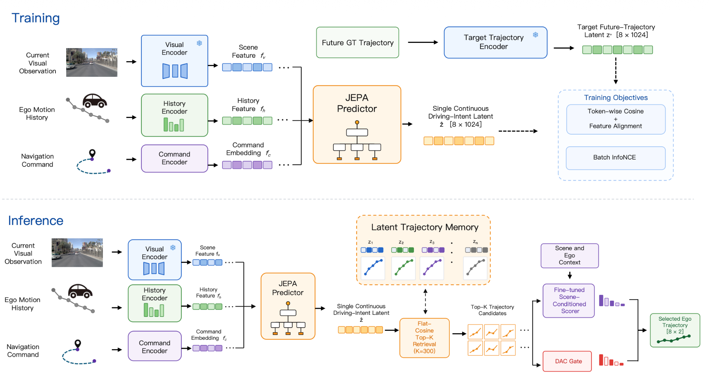

## About Me

I am a research assistant in **Prof. Jun Li's research group at Tsinghua University**, working on latent-space world models (e.g., JEPA).

I received my bachelor's degree in Software Engineering from Guangzhou Institute of Science and Technology in June 2026 and completed my joint training at the **[School of Vehicle and Mobility, Tsinghua University](https://www.svm.tsinghua.edu.cn/)**. Previously, I worked as an embodied intelligence algorithm engineer at the **Center for Brain Inspired Computing Research (CBICR), Tsinghua University**.

## Research Interests

My research focuses on learning and reasoning about the real world with world models. I am particularly interested in:

- **Real-world dynamics and interactions**: Understanding how the world evolves and how agents interact, beyond predicting the next observation.
- **Task-relevant latent representations**: Learning features that matter for downstream goals while reducing the modeling of irrelevant changes.

I explore these questions through **world models, embodied intelligence, and autonomous driving**.

## News

- **[Jun. 2026]** I joined Prof. Jun Li's research group at Tsinghua University as a research assistant.
- **[Jun. 2026]** I completed my bachelor's degree in Software Engineering.

## Education

- **Jointly Trained Student**, **[School of Vehicle and Mobility, Tsinghua University](https://www.svm.tsinghua.edu.cn/)**, Nov. 2025 - Jun. 2026.
- **B.S. in Software Engineering**, School of Artificial Intelligence, Guangzhou Institute of Science and Technology, Sep. 2022 - Jun. 2026.



<h2 id="projects" style="margin: 2px 0px -15px;">Selected Projects</h2>

<ol class="bibliography">
<li>

  

    
  

  

    
<a href="https://github.com/NoctYang/Auto-JEPA">Auto-JEPA</a>

    
A latent-space world model for learning continuous driving intent from visual observations, ego-motion history, and navigation commands.

    

      <a href="https://github.com/NoctYang/Auto-JEPA" class="btn btn-sm z-depth-0" role="button" target="_blank" style="font-size:12px;">Code</a>
    

  

</li>
</ol>



## Honors & Awards

- **First Prize, Programming Finals**, 5th National College Computer Ability Challenge.
- **National-level Project Approval**, Undergraduate Innovation and Entrepreneurship Training Program, 2024.
